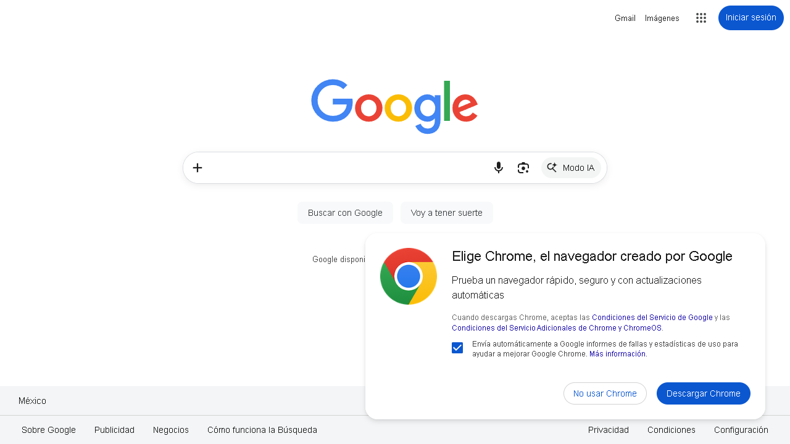
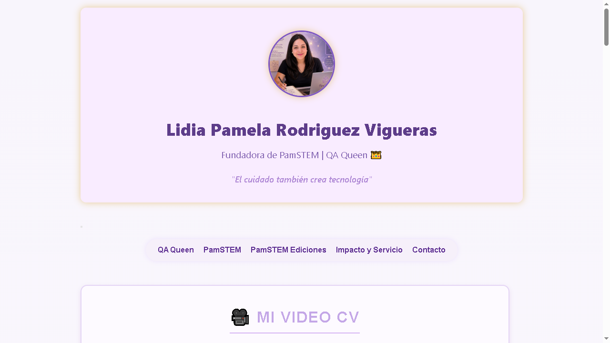
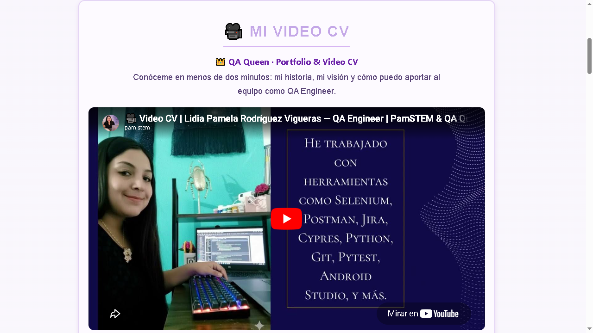
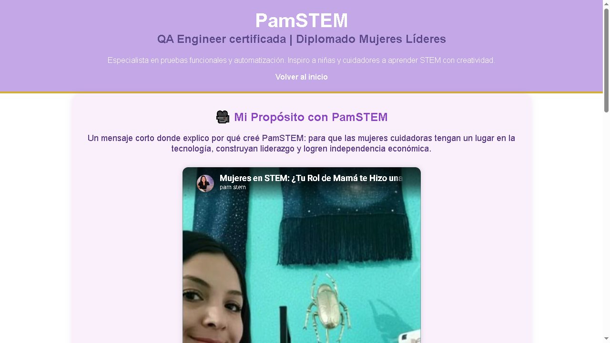

# 🎭 Playwright Python Report

Repositorio de pruebas automatizadas con Playwright y Python para sitios web de PamSTEM.

## 📋 Descripción

Este proyecto contiene tests automatizados para verificar el funcionamiento de los sitios web de **Lidia Pamela Rodríguez Vigueras** (QA Queen & Fundadora de PamSTEM).

## 🧪 Tests Incluidos

### 1. test-web-pamstem.py
Test de 4 pasos que verifica:
1. ✅ Abrir la web principal
2. ✅ Navegar al menú → QA Queen → ver primer video
3. ✅ Navegar al menú → PamSTEM → ver primer video
4. ✅ Cerrar navegador

### 2. test-google.py
Test que verifica el funcionamiento de Google:
1. ✅ Abrir Google en el navegador
2. ✅ Verificar que el título contiene "Google"
3. ✅ Cerrar navegador

### 3. test-python.py
Ejemplo básico de Playwright para aprender la estructura:
1. ✅ Abrir example.com
2. ✅ Mostrar el título de la página
3. ✅ Cerrar navegador

### 4. test-combinado.py
Test que ejecuta múltiples tests en un solo navegador:
1. ✅ Test de Google
2. ✅ Test de PamSTEM (menú, QA Queen, PamSTEM)

### 5. test_web_josh.py
Test que verifica la página de portafolio de Joshua Garcia:
1. ✅ Abrir la web del portafolio
2. ✅ Verificar que el título contiene "Joshua Garcia" o "Portfolio"
3. ✅ Cerrar navegador

**URL**: https://joshuagarciia.myportfolio.com/work

## 🚀 Cómo ejecutar los tests

### Prerrequisitos
```bash
# Instalar Playwright
pip install playwright

# Instalar navegadores
playwright install
```

### Ejecutar un test
```bash
python test-web-pamstem.py
```

### Ejecutar en modo headless (sin navegador visible)
```python
# Cambiar en el código:
browser = p.chromium.launch(headless=True)
```

## 📂 Estructura del proyecto

```
playwright-python-report/
├── test-web-pamstem.py    # Test de 4 pasos para PamSTEM
├── test-google.py         # Test de Google
├── test-python.py         # Ejemplo básico
├── test-combinado.py      # Test combinado (Google + PamSTEM)
├── test_web_josh.py       # Test de portafolio de Joshua Garcia
├── requirements.txt       # Dependencias del proyecto
├── .gitignore             # Archivos excluidos de Git
├── videos/                # Grabaciones de los tests en formato .webm
├── screenshots/           # Capturas de pantalla de los pasos ejecutados
│   ├── google/            # Capturas del test de Google
│   └── pamstem/           # Capturas del test de PamSTEM
└── README.md              # Este archivo
```

## 🎥 Videos y Capturas de Pantalla

### Test Google

**Video grabado:** `videos/` (formato .webm)

**Capturas ejecutadas:**
- 📸 **Paso 1:** Google cargada
  

- 📸 **Paso 2:** Página completa
  

### Test PamSTEM (4 pasos)

**Video grabado:** `videos/` (formato .webm)

**Capturas ejecutadas:**

- 📸 **Paso 1:** Web abierta
  

- 📸 **Paso 2:** Menú hamburger abierto
  

- 📸 **Paso 3:** Sección QA Queen con video
  

- 📸 **Paso 4:** Sección PamSTEM con video
  

## 🔧 Tecnologías usadas

| Tecnología | Versión |
|------------|---------|
| Python | 3.12.4 |
| Playwright | 1.58.0 |
| Chromium | 145.0.7632.6 |
| Firefox | 146.0.1 |
| WebKit | 26.0 |

## 🌐 Sitios probados

- **Web principal**: [qalidiarodriguez.github.io/lidipamelarodriguezvigueras.github.io](https://qalidiarodriguez.github.io/lidipamelarodriguezvigueras.github.io/)
- **Sección PamSTEM**: [pamstem/index.html](https://qalidiarodriguez.github.io/lidipamelarodriguezvigueras.github.io/pamstem/index.html)

## 👩‍💻 Autora

**Lidia Pamela Rodríguez Vigueras**
- QA Engineer certificada
- Fundadora de PamSTEM
- QA Queen 👑

> "El cuidado también crea tecnología"

## 📝 Licencia

MIT License - Feel free to use and learn from this project!

---

⭐️ Si este proyecto te ayuda, dale una estrella en GitHub